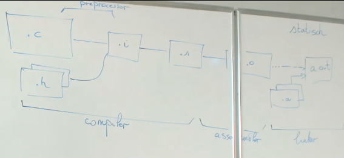

# Deel I: Inleiding
## 1. De terminal

**Log in als gebruiker root met als wachtwoord e=mc\*\*2 en start wanneer van toepassing in
GNOME de terminal-emulator. Tik in het venster de opdracht `“stty -a”` in.**

1. Welke toetsencombinatie heb je nodig om een runnend programma (een proces dus) te onderbreken?  
`CTRL+c`

2. Hoe kan je een runnend programma pauzeren? (Het hervatten van een
programma zullen we later zien)  
`CTRL+z`
3. Wanneer een programma vraagt om gegevens in te typen, met welke
toetsencombinatie kan je dan aangeven dat de invoer stopt?  
`fg 1` (staat voor foreground)

...

## 2. Gebruik van enkele eenvoudige opdrachten
**1. ... Hoe kan je voorwaarts zoeken in een manpagina?**  
`/<zoekterm>`  
vervolgens `n` drukken op volgende match te vinden of `N` voor de vorige  
**2. Hoe kan je zorgen dat er bij het zoeken in een manpagina geen rekening wordt gehouden met het verschil tussen hoofd- en kleine letters?**  
via de `-i` / `--ignore-case` optie NA het ENTER drukken bij zoeken zoekterm  
**3. Bekijk de manpagina van het commando man en ga na hoeveel secties er gekend zijn.**  
kan men zien via `man man`  

Note: bij formatteren van output, best gebruik maken van `printf`, indien niet per se nodig, `echo`  

**4. ...**  

**5. Met de opdracht “ls” krijg je van een directory een overzicht van alle bestanden en subdirectories te zien. Wanneer je geen directory opgeeft, wordt de huidige werkdirectory genomen. Wat doen de opties -l en -h?**  
`ll` is een alias voor `ls -l`  

Note: voor ingebouwde commando's is het interessanter gebruik te maken van `help <zoekterm> less` in tegenstelling tot "the usual" `man`  

**6. Bekijk met “ls /” de inhoud van de hoofddirectory.   Is bij iedere hoofdirectory in een Unix systeem dezelfde structuur**  
uitleg mappen:  
bin: bevat uitvoerbare bestanden  
dev: interfaces voor de hardwarde  
home: bevat home dir van de gebruiker, behalve die van de root (die bevindt zich in root)  
lib & lib64: bevatten dynamische & statische bibliotheken  
sbin: uitvoervare commandos uitsluitend te gebruiken vr de superuser  
sys: zaken die te maken hebben met IO (meeste mappen hierin worden gebruikt door software of hardware, niet meteen door eindgebruiker)  
proc: neemt 0 byte in beslag op de schijf, is een geheugen gedeelte vd kernel en bevat informatie van processen en processen die in uitvoering zijn (opnieuw niet zoals de sys map niet echt een folder die wordt gebruikt door de eindgebruiker, eerder informatief)  
tmp: temporary map, best niet te veel in opslaan, want het is weg bij reboot  
usr: bevat alle software  
var: logbestanden / printviews/ ...  
media: ...  
mnt: mount punt voor bv usb  

# Deel II: Compileren in de Shell

Uitleg over het compileren van een bestand:  
  
Begin bij een bestand met extensie .c  
en enkele extra bestanden erbij met extensie .h (header files)  

`#include <\bestand>` wil zo goed als zeggen "schrijf inhoud van bestand hier neer"  
compiler voegt de .c & .h bestanden samen dmv de "preprocessor" naar een .i bestand(?)  
dit .i bestand wordt dan nog verder compileerd naar een .s file  
(tot daar is dit het werk van de compiler)  
.s file wordt verder compileerd naar een .o bestand  
(dit is het werk van de assembler)  
NOTE: dit .o bestand is nog altijd niet uitvoerbaar  

---
nu heeft men 2 verdere opties  
dynamisch of statisch verdergaan

- stel dat men **statisch** verdergaat:
(handig wnr men het geeft aan iemand waarvan men niet zeker is als men de externe bilbiotheken heeft  
=> geen externe bibliotheken nodig, in tegenstelling tot dynamisch)  
(`dnf install glibc-static` installeren om gebruik te kunnen maken van static)  
hierbij maakt men gebruik van een "linker"(=linkeditor) die de ontbrekende bestanden (die extensie .a hebben) zal toevoegen,  
deze worden dan gekoppeld aan de vorige .o file & zo eindigt men met een a.out bestand  

voordeel: alles zit erin, de uitvoerder hoeft niet te beschikken over bibliotheken of whatever  
nadeel: bij updates van de bibliotheken (als printf) zou men dit moeten hercompileren, (men weet niet zeker als het nog correct is na hercompilatie)  

TL;DR: maken gebruik van compiler => assembler => linker

- stel dat men **dynamisch** verdergaat:
voordeel: bestandsgrootte is beperkter (bv de printf functie hoeft maar eenmalig ingeladen te worden)  
nadeel: system calls doen het wat trager  

EINDE LES:  
Deel over PCI bussen hoeven niet gemaakt te worden
