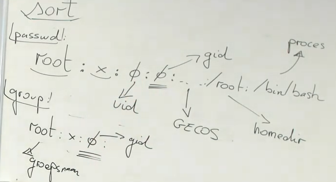

# Deel V: Programmeren in Bash - vervolg
## opdrachten (p.18/51)
intro om volgende oefeningen te begrijpen:  
we gaan de `>` omdraaien om ipv uit te schrijven in te lezen.  
zo zal `ls -l | wc -l` eenzelfde uitvoer hebben als `ls -l > >(wc -l)`.  
We draaien voornamelijk de <> om om blokkeringen te vermijden (gebeurt bij uitlezen van niks of schrijven naar niks)  
Dit heet "process substitution" en kan zorgen voor minder putswerk bij scripts. Note: er worden evenveel kindprocessen aangemaakt & er is dus geen performantiewinst.  

voorbeeld hiervan:
```sh
echo "jan" > read a
echo "hello $a"
```
de variabele a wordt niet opgeslagen omdat het commando gedaan is  
oplossing:
```sh
echo "jan" > meow.txt
read a < meow.txt
echo "hello $a"
```

**31. Hoe kan je ervoor zorgen dat de uitvoer van het commando printf "dit is een fout" niet als standaarduitvoer, maar als standaardfout wordt geïnterpreteerd? De tekst moet dus wel op het scherm getoond worden, maar mag niet doorgepipet worden naar een volgend commando.**  
`printf "dit is een fout" >&2`  
dit ( de `>&2`) is dus een manier om een foutboodschap naar het scherm te schrijven (bij scripting of dergelijke)  

**32. Enkel de standaarduitvoer wordt normaal doorgepipet naar het volgende commando. Hoe kan je (met een wc-filter) het aantal foutmeldingen vragen bij het commando du /etc?**  
`du /etc 2>&1 >/dev/null | wc -l`

**33. Hoe kun je met behulp van de head- en tail-commando's enkel de N-de lijn van een bestand tonen, voor een willekeurige N? Zorg er voor dat geen uitvoer wordt geproduceerd indien het gevraagde lijnnummer groter is dan het aantal lijnen in het bestand.**  
`head -n 18 /etc/passwd | tail -n1`  
geen idee hoe je die "groter dan aantal lijnen in bestand" kan verzwijgen  

**34. Met behulp van de eenvoudige opdracht dos2unix kun je de \<CR>\<LF>-sequenties in een bestand dat door een Windowstoepassing is aangemaakt, vervangen door enkele \<LF>- lijnscheidingstekens, zoals dit op UNIX verwacht wordt. Hoe kun je met behulp van de tr opdracht hetzelfde effect bereiken? Welke zijn de nadelen van deze benadering?**  
`tr` (=translate) kan gebruikt worden om bepaalde karakters te deleten van een bestand, via de `-d` optie
dus om de `\r` van windows te deleten:  
```sh
tr -d '\r' < test.bash > temp
mv temp test.bash
```
! niet lezen en schrijven nr eenzelfde bestand, dan maak je het leeg  
nadeel is dus dat men gebruik moet maken van een tijdelijk bestand  

**35. Het commando uniq -d bestandsnaam is bedoeld om alle lijnen te tonen die meerdere keren voorkomen in een bestand. Echter, indien men dit commando toepast op een bestand met als inhoud**  
>   het
    is
    mooi
    het
    geweest
    is

**dan wordt geen enkele lijn getoond. Hoe komt dit?**  
**Zoek een eenvoudige oplossing hiervoor, door gebruik te maken van een pipe.**  
probleem: de lijnen zijn niet adjacent (=opeenvolgend) dit staat in de `man` van uniq dat dit moet  
oplossing: door bestand te gaan sorteren worden de lijnen wel opeenvolgend  
`sort bestand | uniq -d`


---
klein intermezzo over regulier expressies  
`grep -E` gevolgd door de reguliere expressie  
voorbeeld  
`grep -E "^root:" /etc/passwd`: geeft alle lijnen terug die beginnen met `root:`  

aantallen met reguliere expressies kan via `{min, max}`  
voorbeeld van woorden met 4 of meer opeenvolgende klinkers in een words.txt bestand:  
`grep -E "[aeiouy]{4,}" words.txt`  

groeperen van een expressie:  
`grep -E "([aeiouy].*){7,}" words.txt`:  
dit is een klinker gevolgd door 0 of meerdere tekens `[aeiouy].*`, en als we dit groeperen met 7 of meer  
dan krijgen we het bovenstaande: woorden met 7 of meer opeenvolgende klinkers, gevolgd door (mogelijks) nog wat andere karakters  

`grep -E "([aeiouy]{2}).*\1" words.txt`: woord met exact 2 klinkers gevolgd door 0 of meerdere karakters en dan `\1` is een backreference,  
wat wil zeggen "nogmaals hetzelfde wat je reeds gevonden hebt" woorden als zuigbuis of zwaaihaak matchen op ui of aa  

checken in reguliere expressie als string een getal voorstelt:  
`grep -E "^[0-9]+$" test.txt`  
dit matcht ook op bijvoorbeeld 007  
stel dat we dit niet willen:  
`grep -E "(^[1-9][0-9]*$)|(^0$)" test.txt`  

**36. Het filter-commando grep toont alle lijnen van een bestand die aan een bepaald patroon voldoen. Op welke drie verschillende manieren (drie verschillende opties, met betrekking op de interpretatie van regular expressions) kan dit patroon opgegeven worden? Let erop dat het patroon door het grep-commando moet worden geïnterpreteerd en niet door de shell. Gebruik de drie mogelijkheden om alle lijnen van een bestand te zoeken die een woord bevatten uit de lijst: BEGIN END IF ENDIF. In de man-pages van grep vind je een extra sectie over regular expressions.**  
werd hierboven uitvoerig besproken  

**37. Installeer emacs (yum install emacs) en wijzig de werkdirectory naar /usr/share/emacs/versienummer/etc/tutorials. Voorspel de uitvoer van volgende commando's en test ze dan uit op de Emacs tutorial:**  
• `grep -E 'C\-[a-z] *' TUTORIAL`:  
een C gevolgd door een - gevolgd door een letter  
• `grep -E '(C\-[a-z] *){2}' TUTORIAL`  
• `grep '\(C\-[a-z] *\)\{2\}' TUTORIAL`  
**Het patroon moet tussen enkele of dubbele aanhalingstekens staan, zodat de shell de speciale tekens niet interpreteert, maar het patroon ongewijzigd doorgeeft aan het grep- commando.**  
**38. Wat is de uitvoer van volgend commando?**  
`grep -E '^.*$' TUTORIAL`:  
geeft alles terug, want het start met om het even welk aantal willekeurige karakters en eindigt  
**Wat zijn de twee verschillen met**  
`grep -E '^\.*$' T*`:  
door het escape character wordt letterlijk gezocht op meerdere . (punt) karakters of lege lijnen (want * is 0 of meer)  
**39. 40. 41. 42. 43.**  
werden overgeslagen in de les maar mogen zeker gemaakt worden als oefening  

**44. Gebruik het commando join met aangepaste opties om op basis van de daarnet gecreëerde bestanden ~/passwd en ~/group een lijst af te drukken met op elke lijn enkel drie velden: de gebruikers-ID, de volledige gebruikersnaam en de naam van de primaire groep waartoe de gebruiker behoort. Geef de volledige commandolijn waarmee je deze opdracht hebt uitgevoerd. Hoeveel uitvoerregels zijn er? Hoe heb je dit aantal geteld?**
**Vergelijk met het aantal regels in het passwd bestand. Indien deze aantallen niet overeenkomen heb je ofwel bij deze vraag, ofwel bij de vorige een fout gemaakt.**  
  
Hieruit moet men voornamelijk zien dat zowel passwd en group eenzelfde veld hebben, namelijk `gid` die gebruikt kan worden om beide bestanden te gaan joinen.  

Om deze te gaan joinen moet men deze eerst sorteren.  

bij passwd:  
`sort -t : -k4,4 /etc/passwd > passwd`:  
`-t`: de separator wordt meegegeven  
`-k` het veld om te starten en te eindigen (= uitsluitend op het 4e veld ordenen in dit geval)  
en dan wegschrijven nr een lokaal bestand `passwd`  

bij group:  
`sort -t : -k3,3 /etc/group > group`  

De bestanden gaan joinen  
`join -t : -1 4 -2 3 -o "1.3 1.1 2.1" passwd group`  
`-1` bij de eerste file zeggen op welk veld  
`-2` bij de tweede file op welk veld  
`-o`: het formaat waarop gejoint mag worden  
in dit geval dus van eerste bestand 3e veld en 1e veld & tweede bestand eerste veld  
NOTE: deze worden gejoined via eenzelfde separator  

Het sorten en joinen zou in principe in 1 lijn kunnen gebeurd zijn zonder de tijdelijke bestanden aan te maken:  
`join -t : -1 4 -2 3 -o "1.3 1.1 2.1" passwd group <(sort -t : -k4,4 /etc/passwd) <(sort -t : -k3,3 /etc/group)`  

extra's:  
men kan ook sorteren op numerieke waarden en indien beide velden hetzelfde zijn, overgaan nr een ander veld:  
`sort -t : -n -k4,4 -k1,1 /etc/passwd`  
in omgekeerde volgorde is   
`-r` (reverse)  
op specifieke karakters;  
`-k1.2r,1.4r` (van 2e tot 4e karakter in omgekeerde volgorde)  

nu, stel dat men enkel de numerieke (n) optie wil op de eerst aangegeven velden (ipv globale optie, een specifieke optie):  
`sort -t : -k4n,4n -k5ir,5ir /etc/passwd`  


**45. Sorteer het /etc/passwd bestand, met behulp van het sort commando. Gebruik als primaire sleutel het vierde veld van het bestand. Zorg ervoor dat je in numerieke volgorde sorteert (12 < 100). Regels met gelijke numerieke waarden voor het vierde veld moeten gesorteerd worden met het vijfde veld als secundaire sleutel, waarbij geen onderscheid mag gemaakt worden tussen hoofdletters en kleine letters, en voor de sorteervolgorde nu de omgekeerd alfabetische volgorde moet genomen worden. Geef de volledige commandolijn waarmee je deze opdracht hebt uitgevoerd.**  
`sort -t : -k4n,4n -k5i,5i /etc/passwd`

**46. Gebruik het cut commando met aangepaste opties om van het bestand /etc/passwd alle gebruikersnamen te tonen. Geef opnieuw de volledige commandolijn waarmee je deze opdracht hebt uitgevoerd**  
`cut -d : -f 1 /etc/passwd`

**47. Het commando tee bestandsnaam neemt de standaardinvoer, geeft de invoer ongewijzigd door aan de standaarduitvoer, en kopieert de standaardinvoer tegelijkertijd naar het opgegeven bestand. Gecombineerd met een pipe laat dit je toe de uitvoer van een programma terzelfdertijd op het beeldscherm te bekijken, en te loggen voor later gebruik. Hoe kun je ervoor zorgen dat de uitvoer van een programma tegelijkertijd op het beeldscherm verschijnt, en wordt toegevoegd aan een bestaan, zonder dat de oude inhoud van dat bestand wordt overschreven?**

**Het commando find zoekt in alle subdirectory's vanaf een opgegeven directory naar alle bestanden die aan bepaalde criteria voldoen (naam, grootte ...) en toont alle gewenste informatie van alle bestanden die voldoen. Dit commando heeft heel veel mogelijkheden door het toevoegen van aangepaste opties. Leer de goede opties op te zoeken in de man pages. Het commando genereert dikwijls veel foutmeldingen, die je bij voorkeur omleidt.**  
voorbeeld: vind me alle dev bestanden met één van de specifieke types  

`find /dev ! type f ! type d ! type l ! type p ! type s`  
(opfrisser dat `!` NIET wil zeggen, dus niet bovenstaande types)  
of korter:  
`find /dev \( -type c -o -type b \)`  

ander mooi commando (wat 1 vd eerste vragen was op praktijkexamen vorig jaar)  
geef me ls -l van een bepaald bestand dat aan de find criteria voldoet, doe dit in 1 command  
`find /etc -type f -exec ls -l \{\} \;`  
waarbij dus {} telkens vervangen zal worden door het gevonden bestand  
kan ook gebruik maken van `\+` op het einde ipv `\;` wat als verschil heeft dat het als 1 "instructiefile" wordt gelezen  
en mocht men dan bv ipv `ls -l` `wc -l` doen per bestand zou men op het einde ook nog eens een total krijgen.  
NOTE: genereert ook soms extra ongewenste output  


find heeft ook een `-printf` optie om het als een bepaald formaat uit te schrijven  
bv  
`find /etc -type f -name "pass*" -printf "%s %p\n"`  
om te weten welke bijvoorbeeld passwd allemaal bevat kan dit via het `stat` commando 
`stat passwd`  

antwoord op eerste vraag praktijkexamen vorig jaar (om bij bepaalde find matches een symbolic link te gaan maken)  
`find /etc -type f -name "pass*" -exec cp -s {} \. \;`  
**48. Zoek naar alle bestanden in de /etc directory tree waarvan de naam begint met pass.**  
`find /etc -type f -name "pass*"`  
opgelet, altijd "" rond de naam  
**49. Je kunt ook meerdere testen combineren. Hoe vraag je alle subdirectory's (geen bestanden) waarvoor de naam begint met sh?**  
2 zaken in deze find exec wellicht  
1. directory opgeven  
2. moet voldoen aan bepaald patroon  
`find / -type d -exec grep -E "/sh.*$" \{\ \;}`  
NOTE: `type -d` zoekt naar directories  
duurt even, dus we kunnen pipen  
`find / -type d | grep -E "/sh.*$"`  
kortste methode:  
`find / -type d -name "sh*"`  

**50. Gebruik het find-commando om een lijst te bekomen van alle bestanden in de /usr directory tree met een bestandsgrootte van minstens 1 megabyte. Bij het uitprinten (één lijn per bestand) moet je het volledig pad van de gevonden bestanden laten voorafgaan door de grootte van het bestand. Geef de volledige commandolijn waarmee je deze opdracht hebt uitgevoerd. Let er ook op dat je enkel bestanden in de lijst opneemt en geen directory's.**  
overgeslagen

**51. Gebruik het find-commando om een lijst te bekomen van alle bestanden in je persoonlijke map, die gedurende de laatste twee weken gewijzigd werden. Bij het uitprinten (één lijn per bestand) moet je het volledig pad van de gevonden bestanden laten voorafgaan door het tijdstip van de laatste wijziging. Geef de volledige commandolijn waarmee je deze opdracht hebt uitgevoerd. Let er ook op dat je enkel bestanden in de lijst opneemt en geen directory's.**
overgeslagen
**52. Gebruik het find-commando om een lijst te bekomen van alle subdirectory's van /usr waarin zich C- of C++-headerbestanden (bestanden met suffix .h) bevinden. Gebruik een commandolijn van de gedaante find ... | sort | uniq. Let erop dat enkel de namen van de directory's weergegeven worden.**  
overgeslagen in deze les, wordt opgelost in de volgende les  

**53. 54.**  
hoeft niet gedaan te worden
