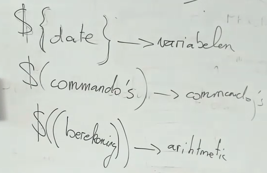

# Deel V: Programmeren in Bash - vervolg
shellvariabelen en commando read
## opdrachten (p.22/51)
oplossing van 52 wordt gegeven deze les  
**52. Gebruik het find-commando om een lijst te bekomen van alle subdirectory's van /usr waarin zich C- of C++-headerbestanden (bestanden met suffix .h) bevinden. Gebruik een commandolijn van de gedaante find ... | sort | uniq. Let erop dat enkel de namen van de directory's weergegeven worden.**  
we zullen dus naar het type file zoeken  
`-type f`  

de suffix .h kan opgevraagd worden via  
`-name "*.h"`  

de grootte van het bestand en de naam kunnen worden getoond dmv de `-printf`, in de man page van find kan men bij de printf optie alle formatteringen terugvinden  
hierbij vindt men dat `%h` alle gevonden mappen waarin deze bestanden zich bevinden geven  
nu moeten we dit nog gaan ordenen (`sort`) en vervolgens de duplicaten eruit halen (`uniq`)  
want uniq werkt enkel geordend men heeft hier 2 interessante opties: namelijk `-u` de unieke (default) 
`-d` de duplicaten  


oplossing dus  
`find /usr -type f -name "*.h" -printf "%h\n" | sort | uniq`  


**...**  


**55. Naast gekende shellvariabelen, zoals PATH, kun je zelf shellvariabelen toevoegen. Tenzij je de declare-opdracht gebruikt, zijn ze steeds van het type string. Er wordt onderscheid gemaakt tussen hoofdletters en kleine letters. Voer de volgende commando's uit:**  
`printf “PATH %s\n” $PATH`: geeft `PATH <het pad dat $PATH is>`  
`printf “dag %s\n” $dag`: error dat dag variabele niet bestaat  
`dag=jan`: variabele instellen (! geen spaties gebruiken)  
`printf “dag %s\n” $dag`: dag jan  
`set`: bijvoorbeeld `set | grep ^dag=` geeft ons de lijn met de waarde die is ingesteld voor de variable dag  

NOTE: `unset dag` zal de variabele verwijderen  
nuttig bij bijvoorbeeld waarden uit arrays te gooien  
**56. Definieer zelf de variabele date met een willekeurige datum als inhoud. Wat is het verschil tussen \$date, \$(date) en \${date}? Onderzoek dit met behulp van het commando echo. Je kunt bijvoorbeeld je eerste script schrijven met de volgende regels:**  
`date="18/5/2022"`: date variabele instellen  
`echo '$date:' $date`: \$date: 18/5/2022  
`echo '${date}:' ${date}` \${date} 18/05/2022  
`echo '$(date):' $(date)` \$(date) \<de datum van vandaag>  
essentie:  
`$(date)` voert de functie date uit, en print dus niet de ingestelde variabele  
`${date}`-> variabele  
`$(date)`-> commando  

**De enkele aanhalingstekens (`''`) garanderen dat de tekst letterlijk wordt doorgegeven aan het echo-commando. Merk op dat de variabele date niet gekend is in de shell die het script heeft opgestart. Elk script wordt namelijk uitgevoerd in een nieuwe shell, met zijn eigen variabelenlijst, instellingen ...**  

**57. Bash ondersteunt vanaf versie 3 de mogelijkheid tot indirecte adressering: je kunt de inhoud van een variabele opvragen door haar naam in een tweede variabele te stoppen, die je invult in \${!varnaam}. Dit is vergelijkbaar met pointers in C en C++. Vul de inhoud van de variabele een willekeurig op, en geef aan de variabele twee als inhoud de string 'een'. Voorspel het resultaat van**  
`echo ${een}`  
`echo ${twee}`  
`echo ${!twee}`  
`echo ${$twee}`  

essentie: bij het gebruik van `!` kijken we eerder naar de variabele naam ipv de inhoud van die variabele. Een soort vn pointer
voorbeeldje  
```sh
a=7
b=a
echo ${!b} # zal 7 printen
```

**In oudere versies van Bash kun je dit gedrag simuleren d.m.v. de opdracht eval. Hoe?**  
`echo $\{$b\}` zou ${a} printen  

dankzij eval loopt hij er een tweede keer door  
`eval echo $\{$b\}` dit print opnieuw 7  


**58. Bekijk de inhoud van de shellvariabelen PS1, PS2, SHLVL, RANDOM, SECONDS en PWD, en zoek de betekenis ervan op in info bash of man bash, sectie Shell Variables. Vraag de inhoud van deze variabelen eerst interactief op (met echo) en schrijf vervolgens een script om de inhoud van deze variabelen op het scherm te tonen. Kan je de verschillen verklaren?**  

`echo $PS1`: primaire prompt string (wat je ziet vóór je typt)  
`echo $PS2`: 2e prompt string  
`echo $RANDOM`: geeft een getal terug tss 0 & 2^15-1  
`echo $SHLVL` toont het shell level, interessant om te weten als men zich al dan niet in een subshell bevindt  
`echo $PWD`: print working directory  
`echo $SECONDS`: kan gebruikt worden om te weten hvl uitvoeringstijd een script genomen heeft  

**59. Hoe kun je commentaar toevoegen in een script?**  
via `#`  

**60. Hoe kun je de variabele PATH zodanig wijzigen dat je bij het aanroepen van een shellscript (dat zich in de actieve directory bevindt), niet steeds naar de actieve directory moet verwijzen? Zorg ervoor dat je oplossing werkt in eender welke directory. Het script moet dus steeds gezocht worden in de werkdirectory, zonder telkens de waarde van PATH aan te passen.**  
`.` -> verwijst nr de huidige map waarin men zich bevindt  

**61. Hoe kun je ervoor zorgen dat wanneer bij de cd-opdracht een relatieve padnaam (dus niet beginnend met /) als argument opgegeven wordt, niet alleen de huidige werkdirectory als prefix uitgeprobeerd wordt, maar ook eenaantal vaste directory's?**  
overgeslagen, no idea  

**62. Hoe kun je met eenzelfde opdracht regelmatig heen en terug schakelen tussen twee mappen als actieve directory?**  
`cd -`  

**63. Je kunt met het commando read tegelijkertijd meerdere variabelen inlezen via het standaard invoerkanaal. Test dit uit met:**  
`read a b c d`  
**Kan je dit aanpassen zodat de gegevens uit een bestand gelezen worden? Probeer dit ook eens met een script op te lossen, en merk op dat de variabelen enkel in het script bestaan!**  
overgeslagen  

**64. Achterhaal de waarde van de bijzondere variabele IFS. Merk op dat `echo $IFS` je niet veel wijzer maakt; `echo "$IFS"` (met aanhalingstekens) verraadt echter al dat er een newline-karakter in de waarde staat. De eigenlijke waarde van IFS kun je vinden met `grep ^IFS < <(set)`**  
de waarde van IFS:  
`grep ÎFS= < <(set)` # geeft IFS=$' \t\n'  
dit is dus een POSIX string die een spatie, een tab en een newline heeft. Op basis daarvan splitst bash (de argumenten bijvoorbeeld)  

**Zoals je weet uit vorige oefeningen, zorgt $' ' hierin voor interpretatie van de escapes. Standaard bevat IFS dus een spatie, een tab en een regeleinde. Deze karakters worden door read gebruikt voor het splitsen van invoervelden, ongeveer zoals o.a. de operator << in C++ en de Scanner-klasse in Java.**  

**Je kunt de waarde van IFS ook (tijdelijk) wijzigen, hetzij door een functie te gebruiken, hetzij door de IFS-variabele vóór het commando in te stellen. Gebruik het commando read om een aantal variabelen in te lezen gesplitst op spaties, dubbelepunten en komma's. Ga de werking na met read.**  
```sh
nano script.sh

# hierin schrijven we
#!/bin/bash

IFS=:

read a b c d
echo ${a} ${b} ${c} ${d}

#sla op
# maak uitvoerbaar
chmod a+x script.sh

./script.sh
ik:eet:graag:appels:en:peren

# d zal nu appels en peren printen
```


**65. Het wijzigen van IFS kan voor verwarring zorgen. Voer volgend script uit:**  

```sh
IFS=':'
x=ik:ben:groot
echo x = $x
echo x = "$x"
echo x = '$x'
grep -E ^x= < <(set)
grep -E ^x < <(set)
declare -p x
declare -p ${!x*}
```
een betere oplossing voor IFS in een script te gaan gebruiken is de IFS enkel voor 1 bepaald commando te doen gelden  
```sh
#!/bin/bash

IFS=: read a b c d
echo a=$a b=$b c=$c d=$d
```
hier zal read dus de argumenten opsplitsen bij `:`  

**66. Je kunt de standaarduitvoer van een commando ook toekennen aan een variabele. Daarbij maak je gebruik van command substitution. Dit is vooral zinvol wanneer de uitvoer van een commando uit slechts één regel bestaat. Indien je slechts een deel van de uitvoer aan de variabele wilt toekennen, dan kun je proberen dit er met cut uit te halen. Voorspel de inhoud van de variabele t na volgende commando's:**

1. `t=$(du /etc/passwd)`
zal de volledige uitvoer van het commando `du /etc/passwd` in de variabele t stopppen
niet echt aangeraden omdat je dan het geheugen vol stopt met al die informatie

2. `t=$(cut -f1 < <(du /etc/passwd))`
in t zal de grootte van het bestand komen te zitten, want men neemt enkel de eerste field waarde op (cut's default delimiter is tab) en de velden van du worden onderscheiden dmv tab

3. `t=$(cut -f1 < <(wc -l /etc/passwd))`
wc -l's output wordt niet onderscheiden door tab, maar door spaties, dus cut zal deze niet juist opsplitsen
hoe weet ik dat wc -l spaties gebruikt?

`wc -l /etc/passwd | xxd` geeft mij de hexadecimale output.
de 20 waarde in deze wil spatie zeggen
bij de voorgaande oefening was dit `09`, wat een tab is

4. `t=$( cut -d " " -f2 < <(wc -l /etc/passwd))`
dit is wel juist, en zal dus het 2e veld geven wnr men de output opsplitst obv spaties het 2e veld is dus de file

5. `t=$(wc -l < /etc/passwd)`
de beste method
zo zorg je ervoor dat je in t altijd een variabele krijgt met een getal

mocht men `wc -l /etc/passwd` gebruiken: hierbij heeft men dan weer de miserie dat niet enkel het getal, maar ook de file als output in t worden opgeslagen


6. `tab=( $(wc -l /etc/passwd) )`
array aanmaken
dmv de IFS zal dus de output worden opgeslagen in als een array van elementen in de tab variabele

7. `echo ${tab[1]}`
een specifiek element van de array printen
best geen `-` gebruiken om de laatste waarden van een array te zien (dus niet  bv `tab[-1]`)
alle waarden van een array zien kan via `@` als index, dus `echo ${tab[@]}`
de sleutels zien van alle elemtenten in de array kan dmv er een `!` voor te plaatsen: `echo ${!tab[@]}`
beter om daar dus over te itereren, dan heeft men meteen ook de waardes (dat is dus bij een hashmap, geen ctabel)
een hashmap is meer een boom die erachter zit dan opeenvolgende elementen
bv
`for i in ${!tab[@]}; do echo î ^{tab[$i]}; done`

aantal elementen weten: `echo ${#tab[@]}`

Als men nu het volledige 2e element wil verwijderen=
`unset tab[1]`

1 tot 5 gaat over command substitution
6 en 7 gaan over met tabellen werken

---
**Arithmetic expansion (rekenen)**  


voor testen op strings (opletten voor spaties):  
die `[]` worden gzn als een test commando  
`if [ $a -eq 5 ]`  
of bv (`""` er best rond zodat hij niet plots a zou inlezen als iets met opties)  
`if [ "$a" == "h" ]`  
beter (dubbele [[ ]]):  
`if [[ "a" == "hallo" ]]`  
hierbij wordt namelijk gebruik gemaak van syntax ipv een test commando  
die `[[]]` laten ons toe te testen op reguliere expressies,  
bij de enkele `[]` zou men dan gebruik moeten maken van `grep`, wat weer een extern commando (te veel) is  
`if [[ "$a" =~^a+$ ]]`  
NOTE, bij reg expressie geen `""` errond, anders maakt hij er een string van  

voor testen op getallen (spaties doen er niet toe hier):  
`if ((a == 5))`  
dit mag ook (hoeft niet):  
`if (($a == 5))`
