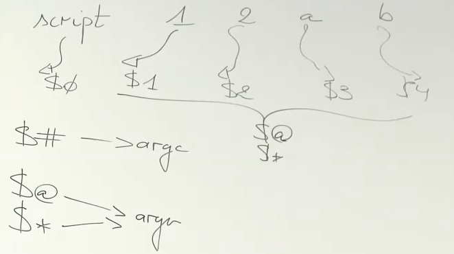

# Deel V: Programmeren in Bash - vervolg
## opdrachten (p.25/51)

**67. Normaal worden alle variabelen door de shell als strings beschouwd. Toch kun je met behulp van een specifiek intern commando rekenkundige bewerkingen op variabelen toepassen. Dit laat je niet alleen toe om optellingen (+), aftrekkingen (-), vermenigvuldigingen (\*), gehele delingen (/ en %) en machtsverheffingen (\*\*) uit te voeren, maar ook om bitoperaties (<<, >>, &, |, ^, ! en ~) of logische testoperaties (&& en ||) toe te passen. Zoek dit specifiek commando op in info bash of man bash; lees de secties Arithmetic Expansion en Arithmetic Evaluation. Pas het gevonden commando toe om het product van twee variabelen, x en y in een variabele z te stoppen. Welk intern (builtin) commando kun je hiervoor als alternatief gebruiken?**  
overgeslagen  


**68. Hoe kun je in een script, met behulp van de variabele SECONDS, de uitvoeringstijd bepalen van een groep commando's? Pas dit bijvoorbeeld toe om de uitvoeringstijd (in seconden) te bepalen van de tijdrovende instructie `ls -lR / > /dev/null 2>&1`**  
overgeslagen  

---
**Argumenten van een script/functie, positionele parameters en speciale parameters**  
  
`$0` -> script naam  
`$1` -> eerste argument  
`$@` -> alle argumenten  
`$#` -> aantal argumenten  
...  

via `set --` eigen positionele parameters invullen, maar dit gaan we niet doen  

**69. Hoe kun je in een shellscript het dertiende argument aanspreken?**  
`${14}`  want `$0` is de scriptnaam  
OPGELET, de accolades erbij om verwarring met `$1 4` te vermijden, dat zou dan bv `${1}4` zijn  

**70. Veronderstel dat een variabele x als waarde de index van een positionele parameter bevat. Hoe kun je de waarde van deze positionele parameter bekomen?**  
via `!`  

bv  
```sh
#!/bin/bash

x=12
echo ${!x} #hierbij wordt x beschouwd als de naam van een variabele
# dus x zou een pointer zijn nr de variabele 12
```

**71. Gebruik het script dat 3 argumenten verwacht. Hoe kun je bij het aanroepen van dit script enkel het eerste en derde argument opgeven?**  
niet zinvol  

**72. In Bash zijn speciale variabelen gedefinieerd, waarvan men in shellscripts gebruik kan maken. Lees de sectie Special Parameters in man bash. Zo staat \$0 voor de naam van het script, \$\$ voor het (unieke) proces-ID of PID van het script en \$# voor het aantal argumenten ervan.**

**Schrijf een script dat zijn eigen naam en proces-ID uitschrijft, evenals zijn totale aantal argumenten, gevolgd door het eerste en het laatste argument.**
```sh
#!/bin/bash

echo eigen naam: ${0}
echo poces ID: ${$}
echo totaal aantal args: ${#}
echo eerste arg: ${1}
la=$#
echo laatste arg: ${!la}
# ofwel
echo ${@:$#:1}
```

**73. Verder bevatten de shellvariabelen \$\* en \$@ alle argumenten van het script als één string. Hoe kun je deze gebruiken om, na bijvoorbeeld één of meerdere shift-opdrachten, weer de oorspronkelijke toestand van de positionele parameters te bekomen?**
Het verschil zit hem in het loopen over beiden en het al dan niet gebruik van `""` errond
vb
```sh
for in $@;do
    echo $i
done
```
wanneer men nu `a b "c d e" f` meegeeft zal nog steeds over ieder element, ongeacht de spaties gelopen worden
dus uitvoer zou
```
a
b
c
d
e
f
``` 
zijn
wanneer men hier nu `""` rond plaatst:
```sh
for in "$@";do
    echo $i
done
```
zal dit `echo "$1"` `echo $2` ... worden
dus
```
a
b
c d e
f
```
als men dit nu hetzelfde zou doen bij `$*`  
komt men zonder `""` uit bij  
`a b c d e f`  
en met nog steeds `a b c d e f`  
NOTE: spatie ofzo tss a b c d afhankelijk van IFS.  

TL;DR:  
`$*` maakt er 1 string van met als koppelteken IFS  
`$@` plaatst rond iedere afzonderlijke parameter `""`  


**74. Tussen \$\* en \$@ bestaat een subtiel verschil, dat men in shellscripts dikwijls nuttig kan aanwenden, vooral in combinatie met for- en while-lussen. Maak de volgende twee scripts:**
**...**  
uitleg gdn adhv vorige oefening  

**75. Wat geldt voor scripts, geldt ook voor functies. Een functie heeft dus net zoals een script een exit-status. De return-opdracht zal bij een bash-functie echter de exit-status beïnvloeden en dus in tegenstelling tot wat je verwacht niet de teruggeefwaarde bepalen. Wil je iets teruggeven, gebruik dan bij het aanroepen van een functie command substitution en binnen de functie echo/printf. Schrijf een niet-recursieve functie die de faculteit van een getal dat als parameter wordt meegegeven, teruggeeft.**  
```sh
#!/bin/bash

function faculteit(){
    local n=$1
    local prod=1
    while ((n>0));do
        ((prod*=n))
        ((n--))
    done
    printf "%5d! %20d\n" $1 $prod
    return 0
}

for i in {0..20};do
    faculteit $1
done
```

mocht men de uitvoer nu in een tabel gestopt willen hebben;
dan kon men het laatste vervangen met
```sh
for i in {0..20};do
    array=( $(faculteit $1) )
done
```
klopt uiteraard nog niet volledig wegens die printf, but the point has been made  


**76. Een functie kan ook uitvoerparameters simuleren. Schrijf een functie wissel die twee scriptparameters van waarde omwisselt.**  
interessant, maar doen we niet  
"te omslachtig en moeilijk"  
---
**Parameter expansion**


**77. De bijzondere notaties \${variabele=waarde} en \${variabele-waarde} bieden een snelle oplossing voor het toewijzen of opvragen van een waarde aan een variabele indien die nog niet gedefinieerd zou zijn. Indien een variabele wel gedefinieerd is, maar leeg, dan biedt deze notatie geen oplossing. Welk alternatief heb je hiervoor, dat beide situaties aankan? Schrijf deze zo compact mogelijk.**  
in een mooie bash code:
```sh
$ str=                      # Null, but not unset
$ echo "${str-default}"     # Expands to value of $str, the empty string
    
$ echo "${str:-default}"    # Expands to "default"
default
```
TL;DR: bij `:` wordt ook gekeken nr een null waarde van de variabele  
verschil `-` en `=`  
bij `=` wordt de variabele assigned (gaat niet bij positional args)  
bij `-` wordt deze vervangen   

PS kan allemaal gevonden worden in `man bash`  

**78. Schrijf een shellscript dat de laatste aantal lijnen van het bestand .bash_history in je home directory naar standaarduitvoer uitschrijft. De waarde van aantal wordt als enige argument meegegeven. Indien deze waarde ontbreekt, moeten er 10 lijnen uitgeschreven worden. Gebruik het commando tail.**
```sh
#!/bin/bash

tail -n ${1:-10} ~/.bash_history
```

---
**Bash v1-compatibele manipulaties**  
eens goed doorlezen, gaat over substrings en dergelijke  
voorbeeldjes  
```sh
#!/bin/bash

tekst="dit is een test"

echo ${tekst: -4} # ${variabele:offset:length}
# test
# opgelet, spatie wel degelijk gebruiken

echo ${tekst//" "/:} # vervangen van alle voorkomens van " " naar :
# dit:is:een:test

echo ${tekst/" "/:} # vervangen van eerste voorkomen
# dit:is een test

echo ${tekst/%" "/:} # eerste match, achteraan te beginnen vervangen
# dit is een:test

echo ${tekst/#" "/:} # not sure
```

**Vereisen minimaal Bash v4**  
uppercase lowercase syntax  
(toupper en tolower)  

mooie voorbeeldjes  
```sh
#!/bin/bash
tekst="dit is een teskt"
echo ${tekst^} # eerste karakter hoofdletter
# Dit is een test

echo ${tekst^} # alles hoofdletter
# DIT IS EEN TEST

echo ${tekst,} # eerste karakter in kleine letter

echo ${tekst,,} # alles in kleine letters
```

NOTE: beide (upper/lower & substring) bovenstaande "manipulaties" worden wellicht in pdf op examen meegegeven  

**79. Vul een variabele x op met de waarde /usr/share/emacs/24.5/etc/tutorials/TUTORIAL.nl. Met welke stringoperatoren kun je x opsplitsen in een directorypad en een bestandsnaam? Los dit op twee manieren op. Hoe kun je deze twee substrings toekennen aan de variabelen dir en file?**  
```sh
x=/a/b/c/de/file
# <        > dit wegknippen
#          <   > en dit ook
file=${x##*/} 
# uitleg: ik knip vooraan de langst willekeurige string weg gevolgd door een /

dir=${x%$file}
# uitleg: men knipt achteraan bij x de file weg & houdt de directoy over
```

**80. Vul een variabele x op met de regel "dit is een \<b>eenvoudige\</b> en \<b>nuttige\</b> oefening". Gebruik de stringoperatoren om de woorden eenvoudige en nuttige uit de variabele te halen. Probeer dit op twee methodes.**  
```sh
#!/bin/bash
x="dit is een <b>eenvoudige</b> en <b>leuke</b> oefening"
# dus allereerst nemen we een zo groot mogelijke string tot we aan een > komen, van achteren te beginnen
t=${x#*>}

# nu het volledige eerste woord nemen
eerste=${t%%<*}
echo $eerste


t=${x%<*}
# nu is het greedy zijn tot de laatste >
tweede=${t##*>}

echo $tweede
```

**81. Indien je in de stringoperatoren de variabele \$@ of \$\* gebruikt, kun je op een relatief eenvoudige manier de laatste positionele parameter opvragen met:**  
**`echo ${@:$#:1}`**  
**Hoe vraag je op een analoge manier de voorlaatste positionele parameter op?**
```sh
echo ${@:$(($#-1)):1}
# want remember ${variabele:offset:length}

#ofwel
#!/bin/bash

n=$# # aantal argumenten
((n--)) # eentje decrementeren
echo ${@:$n:1}
```

**82. Los vorige vraag op door gebruik te maken van:**
    **1. het mechanisme van indirecte adressering en**
    **2. de opdracht eval.**  
overgeslagen  

---
**Arrays**


**83. Vanaf versie 2 kent Bash arrays of tabellen. Helaas kunnen deze in Bash v2 en Bash v3 enkel met niet-negatieve (64-bit) integers geïndexeerd worden. Bash v4 laat associatieve arrays toe, vergelijkbaar met de hashes van Perl. Lees de sectie Arrays in man bash of info bash. Om de mogelijkheden van (niet-associatieve) arrays verder uit te diepen, maak je een array waarbij de gebruikte indices elkaar niet numeriek opvolgen, bijvoorbeeld:**  
data=( 0 1 2 3 4 )  
data[20]=20  
declare -p data # ter controle  
grep ^data= < <(set) # alternatieve controle  
**Vraag volgende informatie op, telkens met één statement:**  
• alle getallen van deze array `${data[@]}`  
• het aantal getallen in de array `${#data[@]}`  
• het getal met index 2 uit de array `${data[2]}`  
• het getal met index 5 uit de array (is leeg in ons voorbeeld) `${data[5]}`  
• het getal met index 20 uit de array `${data[20]}`  
**Pas deze vragen eveneens toe op de builtin array BASH_VERSINFO.**  
`data` gewoon telkens vervangen door `BASH_VERSINFO`  

**84. Getallen op een bepaalde positie (≠ index) in een array a kun je opvragen door de volledige array a[@] door te geven aan de slice-operatie \${variable:offset:length}.**  
**Herneem de vorige oefening en bepaal in één statement**  
• het getal op positie 2 in de array  
• het getal op positie 5 in de array  
• het getal op positie 20 in de array (onbestaand)  
• het laatste getal uit de array  

voorbeeldje van array in te stellen met op specifieke posities  
```sh
#!/bin/bash

tabel=( [0]=aa [8]=bbb [16]=cccc )
echo ${tabel[@]}
tabel2=( ${tabel[@]^}) # dit wordt vervangen door alle elementen waarvan ze 1 voor 1 de eerste letter een hoofdletter wordt
# NOTE: de indexen worden niet mee gekopieerd

echo ${!tabel2[@]}  | xargs -n 1 # reminder dat ! de keys (indexen) zal geven van de tabel
```
